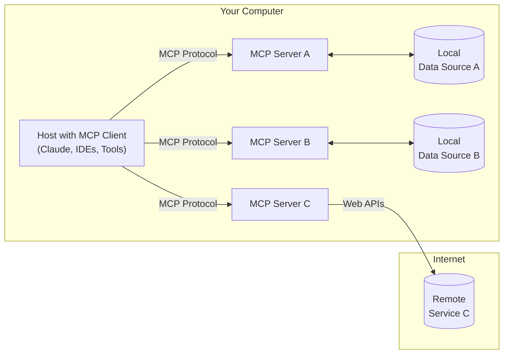
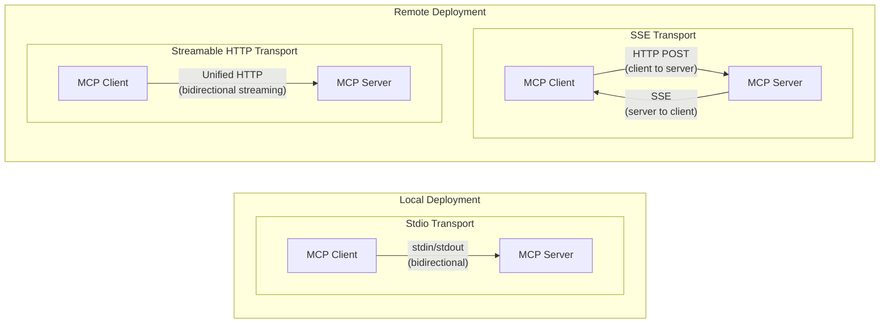

# MCP Concepts

Background reading that pairs with the runnable examples in this repo. For hands-on code, see [transports/](../transports), [openai-integration/](../openai-integration), [function-calling/](../function-calling), and [docker/](../docker).

## Why MCP

MCP isn't revolutionary new technology — it's a standardized protocol for something most AI developers were already doing: giving LLMs access to tools through function calling. The value isn't a new capability, it's a common interface for that capability.

There's a useful distinction between two very different use cases:

1. **Personal MCP use** — integrating servers with Claude Desktop, Cursor, or other personal AI assistants. Most public tutorials cover this.
2. **Backend integration** — building MCP into Python applications and agent systems, where you control both the server and the client.

This repo focuses on the second case: understanding the technical architecture well enough to build custom MCP servers, integrate them into real applications, and make informed calls about when MCP is worth it versus plain function calling.

## Architecture

MCP follows a client-host-server architecture:

- **MCP Hosts** — programs like Claude Desktop, IDEs, or your own Python application that want to access data through MCP
- **MCP Clients** — protocol clients that maintain a 1:1 connection with a server
- **MCP Servers** — lightweight programs that each expose specific capabilities (tools, resources, prompts) through the standardized protocol
- **Local Data Sources** — files, databases, and services on the host machine that a server can access directly
- **Remote Services** — external systems available over the internet that a server can call into

This separation lets each server stay focused on one domain (file access, web search, a database) while any compliant client can use it.



### Core primitives

1. **Tools** — model-controlled functions an LLM can invoke (API calls, computations). The primitive used throughout this repo.
2. **Resources** — application-controlled data that provides context (file contents, database records).
3. **Prompts** — user-controlled templates for LLM interactions.

### Transports

See [transports/README.md](../transports/README.md) for working code. Conceptually:

- **stdio** — communication over stdin/stdout. No network config, best for local/same-machine integrations.
- **SSE** — HTTP for client→server, Server-Sent Events for server→client. Useful for remote connections, now considered legacy.
- **Streamable HTTP** *(introduced March 2025)* — a single unified HTTP endpoint for bidirectional streaming. Recommended for production: 3-5x better performance under concurrency, simpler architecture than SSE, supports stateful and stateless modes.



## MCP vs. plain function calling

At small scale, wiring a function-calling loop by hand (see [function-calling/](../function-calling)) is simpler than standing up an MCP server. The gap in favor of MCP opens up as:

1. **Scale increases** — with dozens of tools, MCP's structure pays for itself.
2. **Reuse matters** — one MCP server can serve multiple clients/applications.
3. **Distribution is needed** — MCP gives you a standard way to run tools on a different machine from the model.

**Use MCP when** you need to share tool implementations across apps, you're building a distributed system, you want to pull in existing community MCP servers, or standardization is itself a product requirement.

**Plain function calling may be better when** the application is simple and self-contained, raw performance matters more than the overhead of a protocol hop, or you're iterating quickly and don't want the extra moving part yet.

## Lifecycle management

Every MCP session goes through three phases:

**1. Initialization** — the client connects and both sides negotiate a protocol version before any tool calls happen:

```python
async with stdio_client(server_params) as (read, write):
    async with ClientSession(read, write) as session:
        await session.initialize()
```

**2. Operation** — the server exposes its tools, the client discovers and calls them:

```python
tools_result = await session.list_tools()
for tool in tools_result.tools:
    print(f"  - {tool.name}: {tool.description}")

result = await session.call_tool(
    tool_call.function.name,
    arguments=json.loads(tool_call.function.arguments),
)
```

**3. Termination** — cleanup happens automatically when the `ClientSession` context manager exits: resources are released and the connection is closed.

### The lifespan object

For servers that need shared, long-lived resources (a DB connection, a cache), FastMCP's `lifespan` gives you a typed, init/teardown-safe place to put them instead of reaching for globals:

```python
from contextlib import asynccontextmanager
from collections.abc import AsyncIterator
from dataclasses import dataclass

from mcp.server.fastmcp import Context, FastMCP

@dataclass
class AppContext:
    db: Database

@asynccontextmanager
async def app_lifespan(server: FastMCP) -> AsyncIterator[AppContext]:
    db = await Database.connect()
    try:
        yield AppContext(db=db)
    finally:
        await db.disconnect()

mcp = FastMCP("My App", lifespan=app_lifespan)

@mcp.tool()
def query_db(ctx: Context) -> str:
    """Tool that uses initialized resources"""
    db = ctx.request_context.lifespan_context.db
    return db.query()
```

This keeps resource lifetime tied to the server's lifetime instead of per-tool-call, and gives tools typed access to shared state via `ctx.request_context.lifespan_context`.

## Further reading

- [MCP documentation](https://modelcontextprotocol.io)
- [MCP specification](https://spec.modelcontextprotocol.io)
- [Python SDK](https://github.com/modelcontextprotocol/python-sdk)
- [Officially supported servers](https://github.com/modelcontextprotocol/servers)
